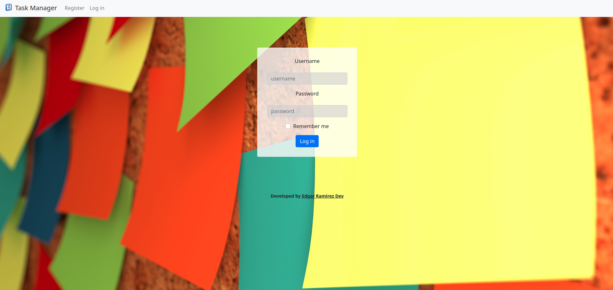
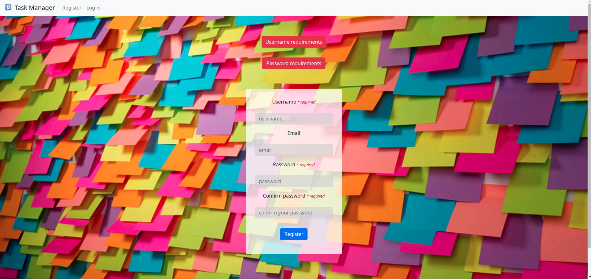
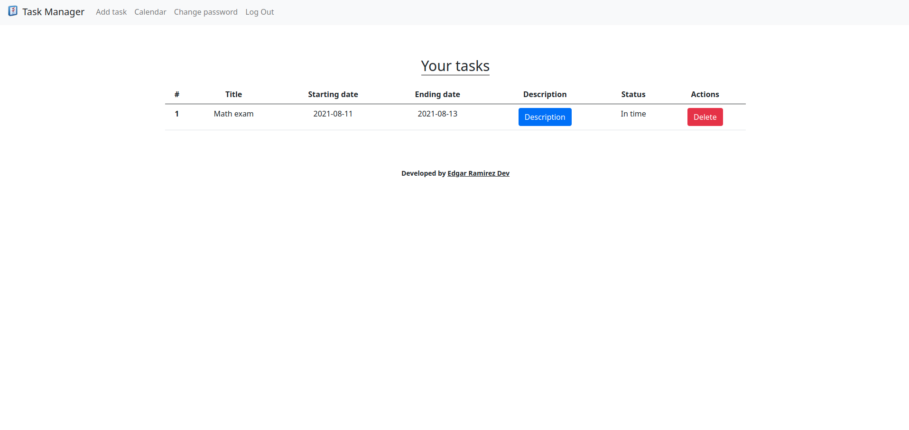
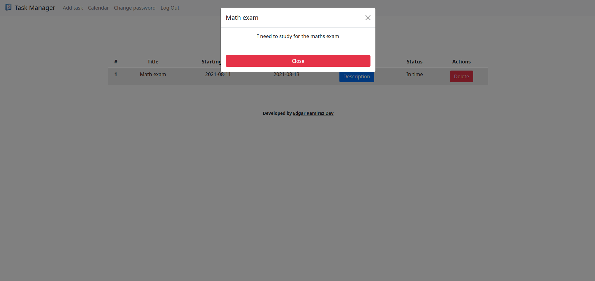
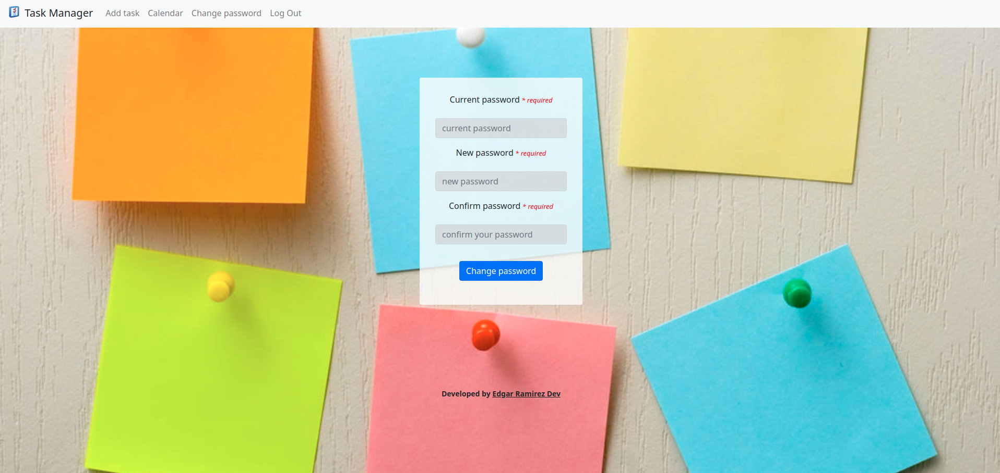
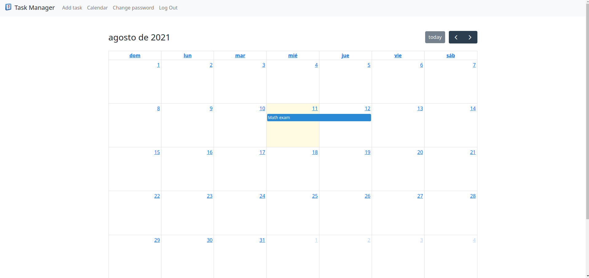

# Task Manager

## Table of Contents

- [About](#about)
- [Getting Started](#getting_started)
- [Try task manager](https://task-manager-earf.herokuapp.com/)

## About <a name = "about"></a>

This is my final project from the CS50 Introduction to Computer Science course.  
Task manager is a web app that helps you to get organized about your upcoming
events. You can create your account, log in to your account, add new tasks, delete those tasks that you already completed or their deadline finished, you can check your upcoming events in a calendar, and change your password.

## Getting Started <a name = "getting_started"></a>

These instructions will get you a copy of the project up and running on your local machine for development and testing purposes. See [deployment](#deployment) for notes on how to deploy the project on a live system.

### Prerequisites

What things you need to install the software and how to install them.

```
Python3
pip3
sqlite3
cs50
Flask-Session
requests
git
```

### Installing

NOTE: Make sure Python, Git, and SQLite are installed in your machine  

First clone this repo using the following command (using your terminal) in the directory of your choice.
```
https://github.com/EdgarRamirezFuentes/Task-manager-flask.git
```

Go to the project directory
```
cd Task-Manager-flask/
```

Install the depencencies using the following command (using your terminal)
```
pip install -r requirements.txt
export SECRET_KEY=value
```

The last step is execute the following command in the same location of the app.py file

```
flask run
```
#### Log in interface


#### Register interface


#### Index interface



#### Change password interface



## Calendar interface


